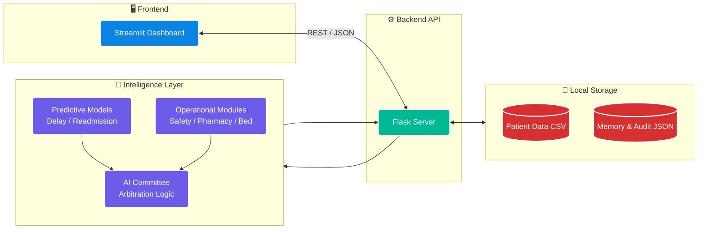
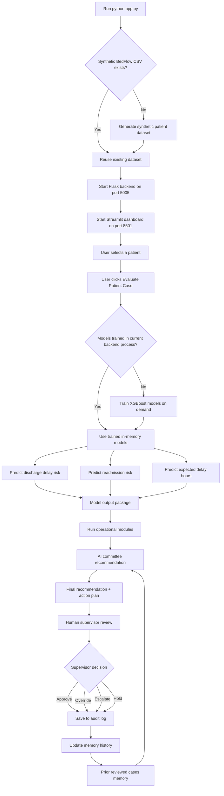
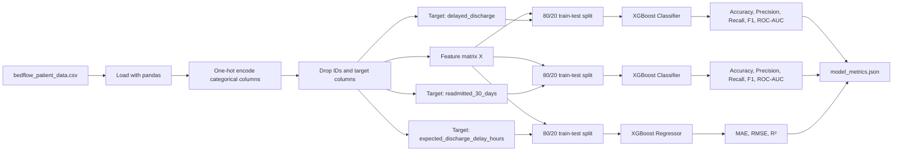
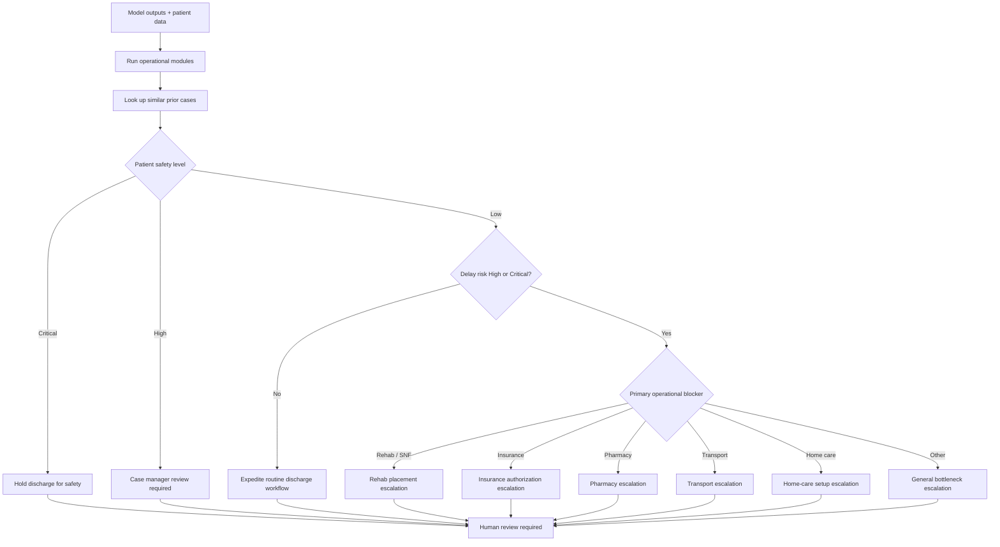

# BedFlow AI — Agentic Discharge Planning & Readmission Risk Decision Support

BedFlow AI is a hospital operations decision-support prototype that predicts discharge delay risk, estimates readmission risk, identifies operational discharge blockers, and recommends a human-reviewed action plan to safely recover inpatient bed capacity.

The goal is simple: **reduce avoidable discharge delays without compromising patient safety**.

> [!IMPORTANT]
> This project is a demonstration system using synthetic/proxy data. It does **not** use Protected Health Information (PHI), does **not** make clinical decisions, and does **not** automatically discharge patients. Every recommendation requires human review.

---

## Why This Matters

Hospitals often lose bed capacity because patients who are medically close to discharge are delayed by operational blockers such as pharmacy reconciliation, transport, insurance authorization, rehab/SNF placement, home-care setup, or missing case-manager review.

Those delays can create downstream pressure:

- ED boarding increases.
- Admitted patients wait longer for beds.
- Discharge teams chase multiple bottlenecks manually.
- Case managers and charge nurses need faster prioritization.

BedFlow AI acts like a **discharge command center**. It combines machine learning, rule-based operational modules, prior-case memory, and a human supervisor workflow.

---

## What BedFlow AI Does

BedFlow AI provides:

- **Discharge delay risk prediction** using XGBoost classification.
- **30-day readmission risk prediction** using XGBoost classification.
- **Expected discharge delay-hours prediction** using XGBoost regression.
- **Operational bottleneck analysis** across pharmacy, transport, rehab/SNF, insurance, home care, patient safety, and bed-capacity pressure.
- **AI committee recommendation** that converts model outputs and operational signals into an action plan.
- **Persistent memory lookup** that compares the current case with prior reviewed cases.
- **Human-in-the-loop approval** before any recommendation is logged.
- **Audit trail** for reviewed cases and supervisor decisions.

---

## High-Level Architecture



---

## End-to-End Application Flow



---

## When Training Happens

Training is handled by:

```text
backend/models.py
```

The main training method is:

```python
BedFlowModels.train_models()
```

There are two ways training happens.

### 1. On-Demand Training During First Prediction

When the user clicks **Evaluate Patient Case**, the dashboard calls:

```text
POST /api/predict_patient
```

Inside the model layer, the app checks whether models have already been trained in the current backend process:

```python
if not self.is_trained:
    self.train_models()
```

That means the **first patient evaluation after a backend restart triggers training automatically**.

After training finishes, the models stay in memory and are reused for later patient evaluations.

### 2. Manual Training from the Dashboard

The **Model Performance** tab includes a button:

```text
Refresh / Train Models
```

That calls:

```text
POST /api/train_models
```

This retrains all three models and refreshes model metrics.

### Important Training Behavior

The current application does **not** save trained model artifacts to disk. It saves only metrics.

| Item | Saved? | Location |
|---|---:|---|
| Trained XGBoost model objects | No | In memory only |
| Model metrics | Yes | `database/model_metrics.json` |
| Synthetic patient dataset | Yes | `database/bedflow_patient_data.csv` |
| Human decisions | Yes | `database/audit_log.json` |
| Prior-case memory history | Yes | `database/bedflow_memory_history.json` |

So the current design is:

> Train lazily on first prediction, keep models in memory, and retrain manually or after a backend restart.

---

## Machine Learning Pipeline



### Models

| Model | Algorithm | Task |
|---|---|---|
| Discharge Delay Risk | `XGBClassifier` | Predicts whether discharge is likely to be delayed |
| Readmission Risk | `XGBClassifier` | Predicts 30-day readmission risk |
| Expected Delay Hours | `XGBRegressor` | Estimates discharge delay hours |

### Risk Level Mapping

The app converts model probabilities into risk labels:

| Probability | Risk Level |
|---:|---|
| `< 0.20` | Low |
| `0.20 - 0.49` | Medium |
| `0.50 - 0.79` | High |
| `>= 0.80` | Critical |

---

## Operational Modules

The operational modules are located in:

```text
backend/research_modules.py
```

These modules are currently deterministic rule-based evaluators. They are not separately trained ML models.

| Module | What It Checks | Example Output |
|---|---|---|
| Patient Safety | Lab stability, vital stability, readmission risk | Hold discharge for MD review |
| Pharmacy | Medication reconciliation, medication complexity, after-hours status | Escalate to on-call pharmacist |
| Transport | Facility transport, family pickup, after-hours pickup | Verify transport ETA |
| Rehab / SNF | Placement pending for rehab or skilled nursing facility | Escalate to case manager / social work |
| Insurance | Authorization pending, especially for facility discharge | Urgent utilization-management review |
| Home Care | Home-care setup, home support, living alone | Expedite home-health agency intake |
| Bed Capacity | Bed occupancy, ED boarding count, predicted delay hours | Prioritize discharge to relieve boarding |

---

## AI Committee Logic

The AI committee is located in:

```text
backend/committee.py
```

It combines:

1. Model predictions
2. Operational module outputs
3. Prior-case memory insight
4. Safety-first guardrails
5. Human review requirement



The committee always sets:

```python
human_review_required = True
```

This is a deliberate safety guardrail.

---

## Memory and Audit System

BedFlow AI includes lightweight persistent memory.

| File | Purpose |
|---|---|
| `database/bedflow_memory_state.json` | Stores current high-level memory state |
| `database/bedflow_memory_history.json` | Stores prior reviewed case patterns |
| `database/audit_log.json` | Stores human-reviewed decisions |

When a human supervisor saves a decision, the app:

1. Writes the decision to the audit log.
2. Creates a scenario signature for the case.
3. Appends the case to memory history.
4. Allows future cases to retrieve similar prior events.

### Similar-Case Matching

The memory lookup scores prior cases using simple matching logic:

| Matching Field | Score |
|---|---:|
| Same primary bottleneck | +3 |
| Same readmission-risk level | +2 |
| Same delay-risk level | +2 |
| Same discharge destination | +1 |

The top matching cases are surfaced as a memory insight during committee review.

This is not vector RAG yet. It is currently case-based memory matching.

---

## API Endpoints

The Flask backend runs on:

```text
http://127.0.0.1:5005
```

| Endpoint | Method | Purpose |
|---|---|---|
| `/api/health` | GET | Backend health check |
| `/api/demo_patients` | GET | Returns available patient records |
| `/api/train_models` | POST | Trains/retrains all ML models |
| `/api/model_metrics` | GET | Returns saved model metrics |
| `/api/predict_patient` | POST | Runs patient-level ML inference |
| `/api/run_committee` | POST | Runs operational modules and committee logic |
| `/api/memory_state` | GET | Returns current memory state |
| `/api/save_human_decision` | POST | Saves supervisor decision and updates memory history |
| `/api/audit_log` | GET | Returns saved human review decisions |

---

## Project Structure

```text
bedflow_ai/
├── app.py
├── requirements.txt
├── README.md
│
├── backend/
│   ├── api.py
│   ├── audit.py
│   ├── committee.py
│   ├── memory.py
│   ├── models.py
│   ├── research_modules.py
│   └── smoke_test_bedflow.py
│
├── frontend/
│   └── dashboard.py
│
├── scripts/
│   └── generate_bedflow_dataset.py
│
├── database/
│   ├── bedflow_patient_data.csv
│   ├── model_metrics.json
│   ├── bedflow_memory_state.json
│   ├── bedflow_memory_history.json
│   └── audit_log.json
│
├── dataset_diabetes/
│   ├── diabetic_data.csv
│   └── IDs_mapping.csv
│
└── .streamlit/
    └── config.toml
```

> Note: The `dataset_diabetes/` files are included in the project package, but the current active model pipeline trains on `database/bedflow_patient_data.csv`.

---

## Setup

### 1. Clone the Repository

```bash
git clone <your-repo-url>
cd bedflow_ai
```

### 2. Create a Virtual Environment

```bash
python -m venv .venv
```

Activate it:

```bash
# Windows
.venv\Scripts\activate

# macOS/Linux
source .venv/bin/activate
```

### 3. Install Dependencies

```bash
pip install -r requirements.txt
```

### 4. Run the Full Application

```bash
python app.py
```

This launches:

```text
Flask backend:        http://127.0.0.1:5005
Streamlit dashboard: http://localhost:8501
```

The launcher also generates the synthetic dataset if it is missing.

---

## Manual Run Option

You can also run the backend and frontend separately.

### Terminal 1 — Backend

```bash
python -m backend.api
```

### Terminal 2 — Frontend

```bash
streamlit run frontend/dashboard.py
```

---

## Testing

Run the smoke test:

```bash
PYTHONPATH=. python backend/smoke_test_bedflow.py
```

On Windows PowerShell:

```powershell
$env:PYTHONPATH="."
python backend/smoke_test_bedflow.py
```

The smoke test checks:

- Imports
- Dataset availability
- Model training
- Committee logic
- Memory initialization and append behavior

---

## Example Current Model Metrics

The current generated dataset produced the following sample metrics.

### Discharge Delay Classifier

| Metric | XGBoost | Baseline |
|---|---:|---:|
| Accuracy | 0.90 | 0.63 |
| Precision | 0.91 | 0.63 |
| Recall | 0.94 | 1.00 |
| F1 | 0.92 | 0.77 |
| ROC-AUC | 0.97 | N/A |

### Readmission Risk Classifier

| Metric | XGBoost | Baseline |
|---|---:|---:|
| Accuracy | 0.94 | 0.82 |
| Precision | 0.93 | 0.82 |
| Recall | 1.00 | 1.00 |
| F1 | 0.96 | 0.90 |
| ROC-AUC | 0.98 | N/A |

### Expected Delay-Hours Regressor

| Metric | XGBoost | Baseline |
|---|---:|---:|
| MAE | 2.18 | 5.81 |
| RMSE | 2.90 | 7.12 |
| R² | 0.83 | -0.04 |

These metrics are based on synthetic data and should be treated as demonstration results only.

---

## Dashboard Tabs

### Control Tower

Main workflow for selecting a patient, running model predictions, running committee analysis, reviewing bottlenecks, and saving the human decision.

### Model Performance

Shows model metrics and allows the user to manually retrain models.

### Memory & Audit Log

Displays persistent memory state and prior human-reviewed audit records.

### Data & Limitations

Explains that the application uses synthetic/proxy data and requires human oversight.

---

## Safety and Governance Design

BedFlow AI is intentionally built as **decision support**, not automation.

Key safeguards:

- Human review is always required.
- Clinical instability overrides bed-pressure optimization.
- The committee can recommend holding discharge.
- Audit logs preserve supervisor decisions.
- No PHI is used.
- Synthetic/proxy data is clearly labeled.
- Recommendations are explainable through module outputs and action plans.

---

## Current Limitations

This is a strong portfolio/capstone prototype, but it is not production hospital software.

Current limitations:

- Trained models are held in memory and are not serialized to disk.
- Training happens inside the Flask web process.
- Data is synthetic/proxy data, not hospital-validated clinical data.
- Operational modules are deterministic rules, not independently validated clinical models.
- Memory is simple case matching, not vector search or full RAG.
- Audit and memory persistence use local JSON files rather than a production database.
- No authentication, role-based access control, or PHI-grade compliance layer is included.
- The included diabetes dataset is not currently wired into the active BedFlow training pipeline.

---

## Future Work

Recommended next improvements:

1. **Persist trained models** using `joblib`, `pickle`, or native XGBoost model serialization.
2. **Add model versioning** so metrics, training data, and model artifacts are traceable.
3. **Move training out of the web request path** into a scheduled or offline training job.
4. **Replace local JSON storage** with SQLite, PostgreSQL, or another durable database.
5. **Add authentication and user roles** for nurses, case managers, physicians, and administrators.
6. **Add a real RAG layer** for discharge policies, payer rules, rehab placement criteria, and hospital SOPs.
7. **Add explainability** with SHAP or feature contribution summaries.
8. **Add drift monitoring** for model performance and operational patterns.
9. **Add richer bed-flow simulation** to estimate downstream ED boarding relief.
10. **Integrate real public healthcare datasets** where appropriate and clearly document data lineage.

---

## Tech Stack

- Python
- Flask
- Streamlit
- XGBoost
- scikit-learn
- pandas
- NumPy
- JSON persistence
- Mermaid diagrams for architecture documentation

---

## Requirements

```text
Flask==3.0.0
streamlit==1.51.0
xgboost==2.0.2
scikit-learn==1.3.2
pandas==2.1.3
numpy==1.26.2
pytest==7.4.3
```

---

## Portfolio Summary

BedFlow AI demonstrates how machine learning and agent-style operational decision support can be applied to a real hospital operations problem:

> Which discharge cases should be prioritized, which ones are unsafe to discharge, which bottlenecks need escalation, and how can a hospital recover beds without bypassing clinical judgment?

The system combines predictive modeling, operational rules, memory, and human-in-the-loop governance into a single working prototype.

---

## Disclaimer

This project is for educational, portfolio, and capstone demonstration purposes only. It is not a medical device, not a clinical decision system, and not intended for use with real patient care without proper validation, governance, privacy review, and regulatory assessment.

"# BedFlow_AI" 
