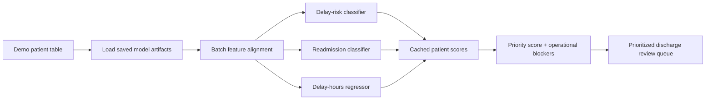
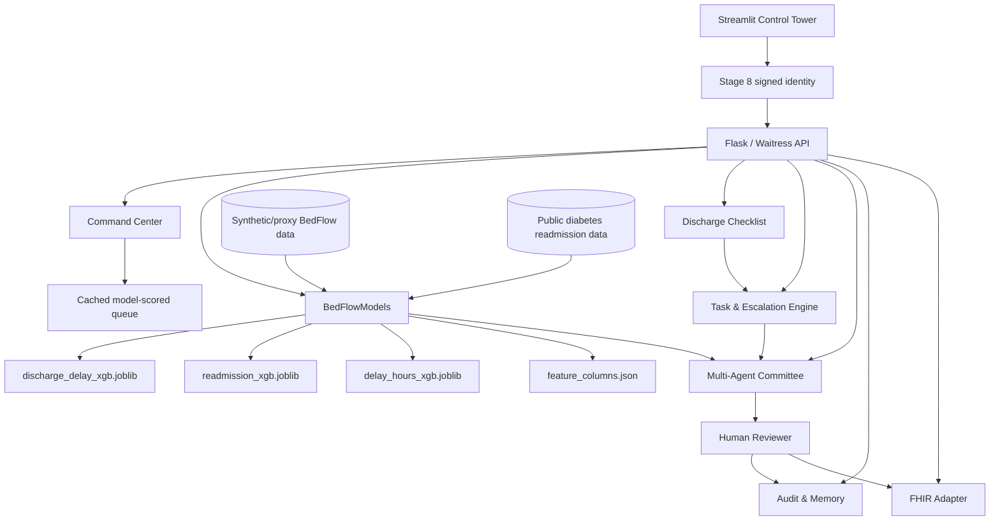
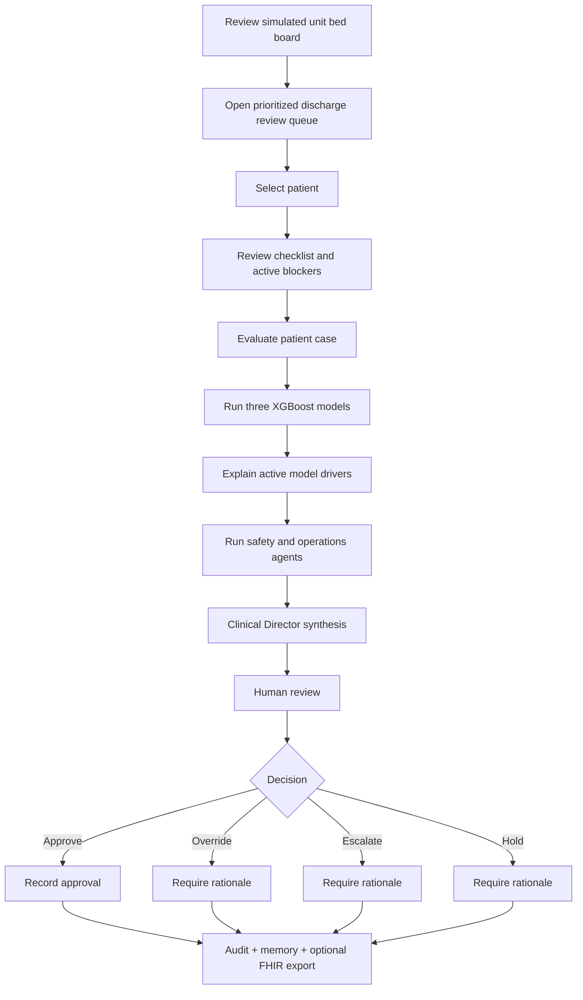
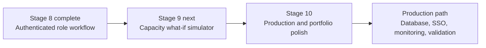

# BedFlow AI

<p align="center">
  <strong>Agentic discharge planning, readmission-risk decision support, and hospital bed-flow prioritization</strong>
</p>

<p align="center">
  
  
  
  
  
  
  
  
  
</p>

BedFlow AI is a portfolio-grade hospital operations prototype that helps users identify discharge blockers, prioritize patient reviews, estimate discharge delay and 30-day readmission risk, coordinate operational tasks, and record human-supervised decisions.

> **Important:** BedFlow AI is a demonstration and decision-support system. It does not diagnose, authorize discharge, replace clinical judgment, or connect to a live EHR.

## Latest release — Stage 8 role-based workflow

This package completes the next major modernization step: **authenticated, role-aware operational workflow with identity-bound auditability**.

### What changed in this release

- signed local user sessions with time-limited bearer tokens;
- backend-enforced permissions rather than UI-only restrictions;
- role-owned task updates for pharmacy, placement, insurance, transport, nursing, physician, and social-work workflows;
- immutable task-event history showing who changed what and when;
- authenticated human decisions tied to a real demo identity and role;
- mandatory rationale for hold, escalation, and override decisions;
- Administrator-only model retraining, audit export, and access-log review;
- updated tests, deployment configuration, roadmap, and safety wording.

**Release status:** Stage 8 complete · 10 automated tests passing · Stage 9 is next.

### Quick navigation

- [Application workflow](#end-to-end-workflow)
- [Stage 8 permissions](#stage-8-authenticated-role-based-workflow)
- [Quick start](#quick-start)
- [Demo login accounts](#demo-login-accounts)
- [API highlights](#api-highlights)
- [Testing](#testing)
- [What remains](#what-remains)

---

## What the application does

BedFlow AI combines six operational views into one workflow:

1. **Simulated hospital command center** — unit pressure, occupancy, ED boarders, expected discharges, and delayed-discharge estimates.
2. **Model-scored discharge review queue** — cached XGBoost predictions for every demo patient.
3. **Discharge readiness checklist** — clinical, pharmacy, transport, insurance, placement, home-care, and social-work blockers.
4. **Task ownership and escalation** — owner, status, SLA timer, overdue state, and escalation level.
5. **Multi-agent decision support** — Patient Safety Advocate, Operations & Flow Manager, and Clinical Director synthesis.
6. **Authenticated workflow, audit, and interoperability** — signed local identities, backend permissions, immutable task events, human decision audit, memory, and FHIR R4-shaped export.

### The three model outputs

| Output | Model | Question answered |
|---|---|---|
| Discharge delay risk | XGBoost classifier | How likely is discharge to be delayed? |
| 30-day readmission risk | XGBoost classifier | How likely is readmission within 30 days? |
| Expected delay hours | XGBoost regressor | If delayed, approximately how many hours? |

All three models use patient-level features. They produce different outputs because each model was trained against a different target.

---

## Modern command-center upgrade

The prioritized queue now uses the **active saved XGBoost artifacts** rather than known outcome labels or proxy target fields.

### How queue scoring works



The queue is batch-scored once and cached. Opening the queue does **not** retrain the models.

Each row includes:

- XGBoost delay-risk probability and risk band;
- XGBoost 30-day readmission probability and risk band;
- XGBoost expected delay-hours estimate;
- primary discharge blocker;
- responsible operational owner;
- recommended next action;
- composite review-priority score;
- active model version and prediction timestamp.

The queue prioritizes **review**. A low-risk patient is not automatically discharged.

---

## Architecture



---

## End-to-end workflow



---

## Data strategy

BedFlow AI uses a transparent hybrid data design.

| Model / module | Source | Status |
|---|---|---|
| Discharge-delay classifier | `database/bedflow_patient_data.csv` | Synthetic/proxy operational data |
| Delay-hours regressor | `database/bedflow_patient_data.csv` | Synthetic/proxy operational data |
| 30-day readmission classifier | `database/readmission_training_data.csv` | Public diabetes hospital encounters transformed to BedFlow schema |
| Unit bed board | Derived from proxy capacity and pressure fields | Simulated demonstration |
| Tasks, audit, memory | Local JSON stores | Demo persistence |

Raw public readmission source:

```text
dataset_diabetes/diabetic_data.csv
```

The transformed readmission layer intentionally excludes race and gender from the model feature schema. The dataset is still a proxy for a general hospital population and is not locally validated clinical data.

---

## Model artifacts

The application loads saved artifacts at backend startup so it can score patients without retraining.

| Artifact | Purpose | Used during prediction? |
|---|---|---:|
| `models/discharge_delay_xgb.joblib` | Trained delay classifier | Yes |
| `models/readmission_xgb.joblib` | Trained readmission classifier | Yes |
| `models/delay_hours_xgb.joblib` | Trained delay-hours regressor | Yes |
| `models/feature_columns.json` | Exact feature layout and order | Yes |
| `models/model_registry.json` | Active version, training timestamp, and provenance | Metadata |
| `models/model_card.md` | Intended use, metrics, and limitations | Documentation |
| `database/model_metrics.json` | Latest evaluation snapshot | Dashboard only |
| `database/model_metrics_history.json` | Previous training-run summaries | Dashboard only |

### Current evaluation snapshot

The included artifacts report approximately:

| Model | Selected metric | Current value |
|---|---:|---:|
| Discharge-delay classifier | ROC-AUC | 0.992 |
| Discharge-delay classifier | F1 | 0.959 |
| Readmission classifier | ROC-AUC | 0.663 |
| Readmission classifier | Recall at 0.55 threshold | 0.460 |
| Delay-hours regressor | MAE | 1.89 hours |
| Delay-hours regressor | RMSE | 2.51 hours |
| Delay-hours regressor | R² | 0.871 |

The operational delay scores are strong partly because the source data is synthetic and rule-structured. The readmission model is more realistic but remains a proxy model with modest discrimination.

---

## Explainability

The patient-level explanation panel combines:

- native XGBoost feature importance;
- the selected patient's active feature values;
- plain-English operational explanations.

This is a lightweight transparency layer, not formal SHAP attribution. The table explains which active inputs were most influential according to the trained model.

---

## Multi-agent committee

The committee intentionally uses a small number of agents with distinct responsibilities:

| Agent | Primary concern |
|---|---|
| Patient Safety Advocate | Clinical stability, readmission risk, medication safety, incomplete care transitions |
| Operations & Flow Manager | Bed pressure, discharge blockers, throughput, task sequencing |
| Clinical Director | Reconciles the two positions and produces a supervised recommendation |

More agents are not automatically better. Additional specialist agents should only be added when they bring unique data, permissions, or reasoning.

The committee can run with:

- Internal Expert System — no API key required;
- Groq — optional;
- Gemini — optional.

---

## Stage 8 authenticated role-based workflow

Stage 8 adds a working **local demonstration authentication and authorization layer**.

### What is enforced

- users sign in and receive a signed, time-limited bearer token;
- model training and artifact management are Administrator-only;
- Bed Managers and Administrators can update any task;
- specialist roles can update only tasks owned by their role;
- permitted final decisions vary by role;
- the backend takes reviewer identity from the token rather than trusting browser fields;
- audit CSV export and access-log viewing are Administrator-only.

### Demonstration roles

| Role | Main workflow authority |
|---|---|
| Administrator | Model operations, all tasks, all decisions, audit export, access log |
| Bed Manager | All operational tasks and supervised committee decisions |
| Physician | Physician-owned tasks and all committee decision actions |
| Nurse | Nurse-owned tasks; hold or escalate decisions |
| Pharmacist | Pharmacy-owned tasks |
| Case Manager | Placement/home-care tasks; hold or escalate decisions |
| Utilization Manager | Insurance-authorization tasks; hold or escalate decisions |
| Social Worker | Social-work-owned tasks |
| Transport Coordinator | Transport-owned tasks |

### Immutable task events

The current task record still shows the latest state, while every status change also appends an immutable event with the old status, new status, actor, role, note, and UTC timestamp.

### Identity-bound audit

Every newly saved human decision records:

- audit ID;
- authenticated user ID, reviewer name, and role;
- AI recommendation and human action;
- written rationale;
- model version and timestamp;
- checklist, task, model-output, and explanation snapshots.

A written reason remains mandatory for override, escalation, and hold.

> This is a portfolio-grade local RBAC implementation. A real hospital deployment must replace it with enterprise SSO/OIDC, MFA, HTTPS, managed sessions, and database-backed identity governance.

---

## FHIR-style interoperability

Stage 7 adds an export-only adapter that maps a selected de-identified case to FHIR R4-shaped JSON resources:

- `Patient`
- `Encounter`
- `Observation`
- `Task`
- `CarePlan`
- `Location`
- `Bundle`

Endpoints:

```text
GET  /api/fhir/capability
POST /api/fhir/bundle
```

The adapter is not a certified FHIR server. It does not implement SMART on FHIR, OAuth, terminology validation, persistence, or live EHR connectivity.

---

## Dashboard tabs

### Control Tower

- simulated hospital capacity snapshot;
- model-scored prioritized queue;
- patient selection;
- discharge checklist;
- XGBoost outputs and explanations;
- multi-agent debate;
- human review.

### Tasks & Escalations

- blocker-generated task queue;
- operational owner;
- status and SLA timer;
- overdue and escalation views;
- backend-enforced role ownership;
- authenticated task updates and immutable event history.

### Model Quality & Transparency

- three-model overview;
- model artifact registry;
- data-source provenance;
- latest metrics and history;
- global feature importance;
- generated model card.

### Memory & Audit Log

- current memory state;
- authenticated decision records;
- patient, role, and decision filters;
- immutable task event history;
- Administrator CSV export and access-log view.

### FHIR Interoperability

- generate and preview a FHIR R4-shaped bundle;
- include current model predictions as `Observation` resources;
- download JSON.

### Data & Limitations

- synthetic/public data split;
- decision-support boundaries;
- no-PHI statement;
- known limitations.

---

## API highlights

| Endpoint | Method | Purpose |
|---|---|---|
| `/api/health` | GET | Backend, model, version, dataset, and authentication readiness |
| `/api/auth/login` | POST | Authenticate a local demo user and issue a signed token |
| `/api/auth/me` | GET | Resolve the authenticated identity and permissions |
| `/api/auth/role_matrix` | GET | Show role permissions and allowed decisions |
| `/api/demo_patients` | GET | Demo patient records |
| `/api/hospital_capacity` | GET | Simulated capacity snapshot enriched by cached model scores |
| `/api/discharge_queue` | GET | Model-scored prioritized review queue |
| `/api/predict_patient` | POST | Three XGBoost predictions for one patient |
| `/api/explain_patient` | POST | Patient-level model reasons |
| `/api/discharge_checklist` | POST | Readiness checklist and blockers |
| `/api/tasks/sync` | POST | Generate/update patient tasks for an authenticated workflow |
| `/api/tasks/update_status` | POST | Role-authorized task update |
| `/api/tasks/events` | GET | Immutable task event history |
| `/api/run_committee` | POST | Full multi-agent decision workflow |
| `/api/save_human_decision` | POST | Identity-bound human decision record |
| `/api/audit/export.csv` | GET | Administrator audit export |
| `/api/access_log` | GET | Administrator access-event log |
| `/api/model_governance` | GET | Artifact and version registry |
| `/api/train_models` | POST | Explicit retraining and artifact publication |
| `/api/fhir/bundle` | POST | FHIR R4-shaped export bundle |

---

## Project structure

```text
bedflow_ai/
├── app.py
├── README.md
├── CHANGELOG.md
├── requirements.txt
├── Dockerfile
├── Procfile
├── railway.json
├── .env.example
├── backend/
│   ├── api.py
│   ├── auth.py
│   ├── models.py
│   ├── command_center.py
│   ├── discharge_checklist.py
│   ├── tasks.py
│   ├── committee.py
│   ├── research_modules.py
│   ├── rag.py
│   ├── memory.py
│   ├── audit.py
│   ├── data_sources.py
│   ├── fhir_adapter.py
│   └── test_*.py
├── frontend/
│   └── dashboard.py
├── training/
│   └── train_models.py
├── scripts/
│   ├── generate_bedflow_dataset.py
│   └── prepare_diabetes_readmission_data.py
├── models/
│   ├── discharge_delay_xgb.joblib
│   ├── readmission_xgb.joblib
│   ├── delay_hours_xgb.joblib
│   ├── feature_columns.json
│   ├── model_registry.json
│   └── model_card.md
├── database/
│   ├── bedflow_patient_data.csv
│   ├── readmission_training_data.csv
│   ├── model_metrics.json
│   ├── model_metrics_history.json
│   ├── tasks.json
│   ├── task_events.json          # runtime-created
│   ├── demo_users.json           # runtime-created password hashes
│   ├── access_log.json           # runtime-created
│   ├── audit_log.json
│   └── bedflow_memory_*.json
├── dataset_diabetes/
└── docs/
    └── STAGE_8_ROLE_BASED_WORKFLOW.md
```

---

## Quick start

### 1. Create a virtual environment

```bash
python -m venv .venv
```

Windows:

```powershell
.venv\Scripts\activate
```

macOS/Linux:

```bash
source .venv/bin/activate
```

### 2. Install dependencies

```bash
pip install -r requirements.txt
```

### 3. Optional environment file

```bash
cp .env.example .env
```

On Windows PowerShell:

```powershell
Copy-Item .env.example .env
```

API keys are only needed for Groq or Gemini committee mode.

### 4. Start the full application

```bash
python app.py
```

Default local addresses:

```text
Dashboard: http://localhost:8501
Backend:   http://127.0.0.1:5005
Health:    http://127.0.0.1:5005/api/health
```

The launcher prepares missing datasets, starts the API with Waitress when available, and starts Streamlit.

### 5. Sign in to the Stage 8 workflow

Select a demonstration user in the sidebar. The default local password is:

```text
BedFlowDemo!
```

### Demo login accounts

| Username | Demo identity | Role | Main authority |
|---|---|---|---|
| `admin` | Demo Administrator | Administrator | Model operations, all tasks, all decisions, audit export |
| `bedmanager` | Jordan Lee | Bed Manager | All operational tasks and supervised decisions |
| `physician` | Dr. Maya Patel | Physician | Physician tasks and all committee decision actions |
| `nurse` | Alex Morgan, RN | Nurse | Nursing tasks; hold or escalate |
| `pharmacist` | Taylor Chen, PharmD | Pharmacist | Pharmacy-owned tasks |
| `casemanager` | Sam Rivera | Case Manager | Placement and home-care tasks; hold or escalate |
| `utilization` | Chris Bennett | Utilization Manager | Insurance-authorization tasks; hold or escalate |
| `socialworker` | Jamie Brooks | Social Worker | Social-work-owned tasks |
| `transport` | Morgan Davis | Transport Coordinator | Transport-owned tasks |

All demonstration users initially use the same local password. Set `BEDFLOW_DEMO_PASSWORD` before the first startup to use a different password. Existing generated password hashes are retained in `database/demo_users.json`; delete that file only when intentionally resetting the demo identities.

> These accounts are for local demonstration only. Do not use the default password or local identity store for an internet-facing production deployment.

---

## Environment variables

| Variable | Default | Purpose |
|---|---|---|
| `BEDFLOW_API_HOST` | `127.0.0.1` | Internal API host |
| `BEDFLOW_API_PORT` | `5005` | Internal API port |
| `BEDFLOW_API_URL` | `http://127.0.0.1:5005/api` | Streamlit-to-API address |
| `BEDFLOW_DASHBOARD_PORT` | `8501` | Local Streamlit port |
| `PORT` | platform supplied | Public Streamlit port on Railway/other platforms |
| `BEDFLOW_USE_WAITRESS` | `true` | Use Waitress instead of Flask development server |
| `BEDFLOW_AUTH_SECRET` | local demo fallback | Signs Stage 8 bearer tokens; set a strong secret outside local demos |
| `BEDFLOW_DEMO_PASSWORD` | `BedFlowDemo!` | Initial password used when demo users are first generated |
| `BEDFLOW_TOKEN_MAX_AGE_SECONDS` | `28800` | Signed-token lifetime (8 hours) |
| `GROQ_API_KEY` | unset | Optional Groq committee mode |
| `GEMINI_API_KEY` | unset | Optional Gemini committee mode |

Never commit `.env`.

---

## Docker and Railway

Build locally:

```bash
docker build -t bedflow-ai .
docker run --rm -p 8501:8501 bedflow-ai
```

The included `railway.json`, `Dockerfile`, and `Procfile` support a single-service deployment in which Streamlit is public and the API runs internally in the same container.

Set API keys as platform secrets, not in the repository.

---

## Training and artifacts

Prepare the public readmission layer:

```bash
python scripts/prepare_diabetes_readmission_data.py
```

Train and publish all artifacts:

```bash
python training/train_models.py
```

Or use the Administrator-protected endpoint:

```text
POST /api/train_models
Authorization: Bearer <administrator-token>
```

Training is explicit. Normal queue loading and patient evaluation use the saved artifacts.

---

## Testing

Run the automated suite:

```bash
pytest -q
```

Run the broader smoke test:

```bash
python backend/smoke_test_bedflow.py
```

The current automated suite contains **10 tests** covering:

- FHIR bundle structure;
- batch XGBoost queue scoring;
- protection against outcome-column leakage during inference;
- simulated capacity metadata;
- signed login and `/auth/me` identity resolution;
- role-owned task authorization at both helper and API levels;
- immutable task event creation;
- identity-bound audit fields;
- protected decision actions and mandatory exception rationale;
- import, dataset, model, committee, memory, and API smoke checks.

---

## Completed upgrade stages

1. Command center and prioritized queue
2. Discharge readiness checklist
3. Task ownership and escalation
4. Patient-level model explanations
5. Model artifacts, registry, metrics history, and model card
6. Public readmission-data training layer
7. FHIR R4-shaped interoperability export
8. **Authenticated local role-based workflow** — signed users, backend permissions, role-owned task updates, immutable task events, identity-bound decisions, administrator audit export, and access logging

---

## What remains



### Stage 9 — Capacity what-if simulator

This is now the next feature stage:

- simulate clearing pharmacy, transport, insurance, placement, and home-care blockers;
- add case-management or transport capacity;
- compare current versus simulated beds recovered;
- estimate delay-hours removed and patients moved to discharge-ready review;
- estimate potential ED boarding relief;
- save and compare named scenarios.

### Stage 10 — Portfolio and production polish

- screenshots and demo GIF/video;
- public GitHub Pages landing page;
- GitHub Actions CI workflow;
- PostgreSQL persistence and transactional audit storage;
- structured logging and monitoring;
- model calibration and threshold analysis;
- patient-group validation split;
- fairness/subgroup review;
- formal SHAP explanations;
- enterprise SSO/OIDC, MFA, managed sessions, and HTTPS;
- SMART on FHIR/OAuth only if moving toward real integration.

---

## Known limitations

- The unit bed board is simulated and inferred; it is not a live ADT feed.
- The operational delay models use synthetic/proxy data.
- The readmission model uses a public diabetes-focused dataset as a proxy for a broader discharge population.
- JSON persistence and local access logs are not safe for concurrent multi-user production workloads.
- Authentication is a signed local demonstration layer, not enterprise SSO, MFA, or hospital identity governance.
- The FHIR output is R4-shaped demonstration JSON, not certified conformance.
- Agent recommendations can be generated by deterministic rules or optional LLMs and always require human review.
- Model scores must never be treated as a discharge order.

---

## Safety statement

BedFlow AI is designed to answer:

> “Which cases should an authorized hospital team review first, what is blocking discharge, and what operational action might help?”

It is not designed to answer:

> “Should this patient be discharged automatically?”

Final discharge readiness must remain with authorized clinical staff using the complete patient record and local policy.

---

**README status:** Updated for the Stage 8 RBAC release and validated against the packaged code and automated test suite on 2026-07-11.
