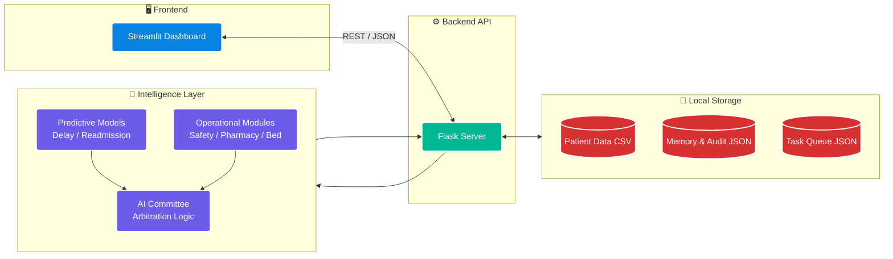
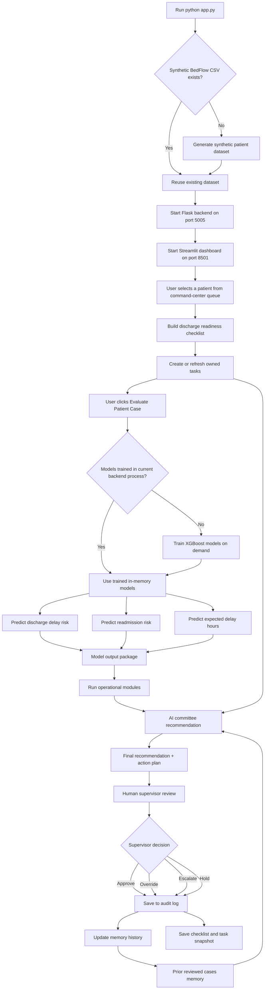
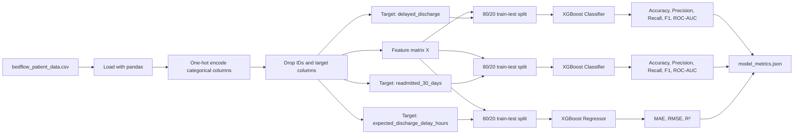
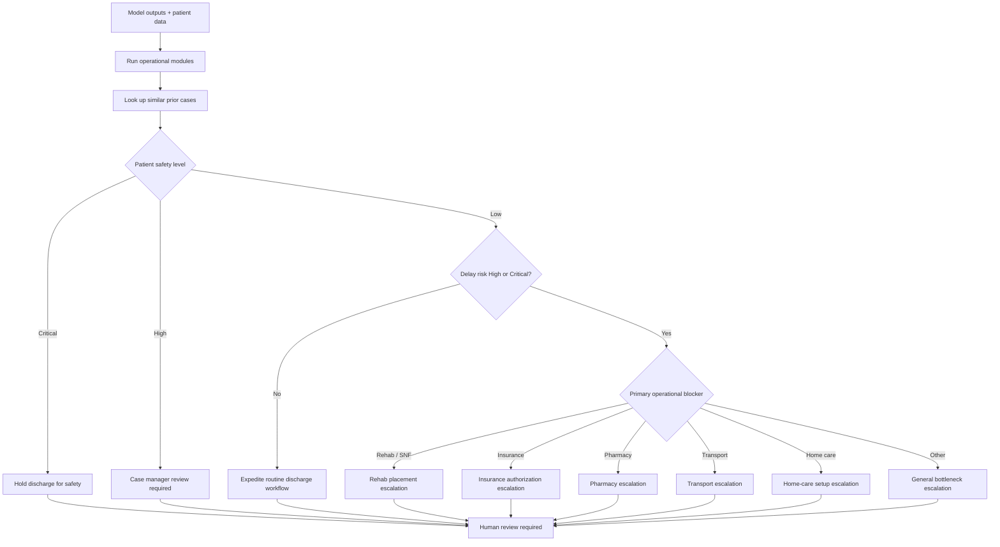

# BedFlow AI — Agentic Discharge Planning & Readmission Risk Decision Support

BedFlow AI is a hospital operations decision-support prototype that predicts discharge delay risk, estimates readmission risk, identifies operational discharge blockers, and recommends a human-reviewed action plan to safely recover inpatient bed capacity.

The goal is simple: **reduce avoidable discharge delays without compromising patient safety**.

> [!IMPORTANT]
> This project is a demonstration system using synthetic/proxy data. It does **not** use Protected Health Information (PHI), does **not** make clinical decisions, and does **not** automatically discharge patients. Every recommendation requires human review.

---

## Why This Matters

Hospitals often lose bed capacity because patients who are medically close to discharge are delayed by operational blockers such as pharmacy reconciliation, transport, insurance authorization, rehab/SNF placement, home-care setup, or missing case-manager review.

Those delays can create downstream pressure:

- ED boarding increases.
- Admitted patients wait longer for beds.
- Discharge teams chase multiple bottlenecks manually.
- Case managers and charge nurses need faster prioritization.

BedFlow AI acts like a **discharge command center**. It combines machine learning, rule-based operational modules, prior-case memory, and a human supervisor workflow.

---

## What BedFlow AI Does

BedFlow AI provides:

- **Discharge delay risk prediction** using XGBoost classification.
- **30-day readmission risk prediction** using XGBoost classification.
- **Expected discharge delay-hours prediction** using XGBoost regression.
- **Operational bottleneck analysis** across pharmacy, transport, rehab/SNF, insurance, home care, patient safety, and bed-capacity pressure.
- **Discharge readiness checklist** that converts raw blocker flags into owned checklist items, severity, completion percentage, and recommended actions.
- **Task ownership and escalation workflow** that turns active blockers into role-owned tasks with statuses, SLA timers, overdue flags, and escalation levels.
- **Model explainability and risk reasons** that show top patient-specific drivers for discharge delay, readmission risk, and expected delay hours.
- **AI committee recommendation** that converts model outputs, checklist status, and operational signals into an action plan.
- **Persistent memory lookup** that compares the current case with prior reviewed cases.
- **Human-in-the-loop approval** before any recommendation is logged.
- **Audit trail** for reviewed cases and supervisor decisions.
- **FHIR-style interoperability export** that maps a de-identified case into Patient, Encounter, Observation, Task, CarePlan, Location, and Bundle resources.

### Stage 1 Command Center Upgrade

This version adds the first professionalization stage: a hospital command-center view before the single-patient review workflow.

New Stage 1 features include:

- Hospital-wide capacity KPI cards.
- Unit-level bed board with pressure level, occupied beds, open beds, pending discharges, delayed discharges, and ED boarders.
- Prioritized multi-patient discharge queue.
- Operational priority score for bed recovery.
- Owner role and next-action columns for each patient blocker.
- Patient selection directly from the command-center queue.

The command-center queue is intentionally fast. It uses existing operational proxy fields and does **not** retrain or run the XGBoost models for every patient in the queue. Full ML inference still happens when the user clicks **Evaluate Patient Case** for a selected patient.

### Stage 2 Discharge Readiness Checklist Upgrade

This version also adds the second professionalization stage: a hospital-style discharge readiness checklist.

New Stage 2 features include:

- Structured discharge readiness checklist for each selected patient.
- Completion percentage, readiness status, and active blocker count.
- Severity levels for blockers: Critical, High, Medium, Low.
- Owner roles for each blocker: Physician, Pharmacy, Case Manager, Utilization Management, Transport, Social Worker, and Family / Case Manager.
- Active blocker table with recommended next action.
- Full checklist expander in the UI.
- Committee logic that uses checklist blockers before recommending discharge actions.
- Audit log support for saving the checklist used during human review.

The checklist does not train another model. It turns existing operational fields into a more realistic hospital workflow.

### Stage 3 Task Ownership and Escalation Workflow Upgrade

This version adds the third professionalization stage: discharge blockers now become operational work items.

New Stage 3 features include:

- Local task workflow store in `database/tasks.json`.
- Task generation from active discharge checklist blockers.
- Owner role per task: Physician, Pharmacy, Transport, Case Manager, Utilization Management, Social Worker, or Bed Manager.
- Task status tracking: Pending, In Progress, Blocked, Escalated, and Completed.
- SLA timers and overdue detection.
- Escalation level calculation based on severity and overdue status.
- Patient-level task panel in the Control Tower.
- Hospital-wide **Tasks & Escalations** tab.
- Task snapshot included in the human-review audit payload.

This stage makes BedFlow feel more like a real hospital workflow product because it does not only identify a blocker; it assigns the work, tracks its status, and flags overdue items.

### Stage 4 Explainability and Risk Reasons Upgrade

This version adds the fourth professionalization stage: model outputs now include plain-English risk reasons and feature-driver tables.

New Stage 4 features include:

- Patient-level model explanation panel in the Control Tower.
- Top drivers for discharge delay risk.
- Top drivers for 30-day readmission risk.
- Top drivers for expected discharge delay hours.
- Plain-English explanation summary for the selected patient.
- Global feature-importance tables in the Model Performance tab.
- Audit log support for saving the explanation payload used during human review.

The current explanation method uses native XGBoost feature importance combined with the selected patient's active feature values. It is intentionally lightweight and does not require SHAP. A production system could add formal SHAP explanations, calibration, fairness checks, versioned model cards, and clinical governance review.


### Stage 7 FHIR-Style Interoperability Upgrade

This version adds an export-only interoperability layer for portfolio and integration demonstrations.

- Generates de-identified FHIR R4-shaped JSON.
- Maps BedFlow patient-flow data to Patient, Encounter, Observation, Task, CarePlan, Location, and Bundle resources.
- Adds `GET /api/fhir/capability` and `POST /api/fhir/bundle`.
- Adds a dashboard tab to preview and download the bundle.
- Does not claim certified FHIR conformance, SMART on FHIR authorization, EHR persistence, or clinical validation.

---

## High-Level Architecture



---

## End-to-End Application Flow



---

## When Training Happens

Training is handled by:

```text
backend/models.py
```

The main training method is:

```python
BedFlowModels.train_models()
```

There are now three ways model lifecycle behavior happens.

### 1. Saved Artifact Loading at Backend Startup

When the Flask backend starts, `BedFlowModels.__init__()` attempts to load the latest saved artifacts from:

```text
models/discharge_delay_xgb.joblib
models/readmission_xgb.joblib
models/delay_hours_xgb.joblib
models/feature_columns.json
models/model_registry.json
```

If those files exist, predictions run immediately using the saved model version.

### 2. On-Demand Fallback Training

When the user clicks **Evaluate Patient Case**, the dashboard calls:

```text
POST /api/predict_patient
```

If no model is loaded in memory and no saved artifacts exist, the backend trains the models and publishes artifacts automatically. This keeps the demo easy to run even after a clean unzip.

### 3. Manual Training and Publishing

The **Model Performance & Governance** tab includes:

```text
Train & Publish Versioned Models
```

That calls:

```text
POST /api/train_models
```

You can also train from the command line:

```bash
python training/train_models.py
```

### Important Training Behavior

| Item | Saved? | Location |
|---|---:|---|
| Trained XGBoost model objects | Yes | `models/*.joblib` |
| Feature-column order | Yes | `models/feature_columns.json` |
| Model registry/version | Yes | `models/model_registry.json` |
| Generated model card | Yes | `models/model_card.md` |
| Latest model metrics | Yes | `database/model_metrics.json` |
| Metrics history | Yes | `database/model_metrics_history.json` |
| Synthetic patient dataset | Yes | `database/bedflow_patient_data.csv` |
| Human decisions | Yes | `database/audit_log.json` |
| Prior-case memory history | Yes | `database/bedflow_memory_history.json` |

So the current Stage 5 design is:

> Load saved model artifacts when available; otherwise train and publish artifacts on demand for the demo.

---

## Machine Learning Pipeline



### Models

| Model | Algorithm | Task |
|---|---|---|
| Discharge Delay Risk | `XGBClassifier` | Predicts whether discharge is likely to be delayed |
| Readmission Risk | `XGBClassifier` | Predicts 30-day readmission risk |
| Expected Delay Hours | `XGBRegressor` | Estimates discharge delay hours |

### Risk Level Mapping

The app converts model probabilities into risk labels:

| Probability | Risk Level |
|---:|---|
| `< 0.20` | Low |
| `0.20 - 0.49` | Medium |
| `0.50 - 0.79` | High |
| `>= 0.80` | Critical |

---

## Operational Modules

The operational modules are located in:

```text
backend/research_modules.py
```

These modules are currently deterministic rule-based evaluators. They are not separately trained ML models.

| Module | What It Checks | Example Output |
|---|---|---|
| Patient Safety | Lab stability, vital stability, readmission risk | Hold discharge for MD review |
| Pharmacy | Medication reconciliation, medication complexity, after-hours status | Escalate to on-call pharmacist |
| Transport | Facility transport, family pickup, after-hours pickup | Verify transport ETA |
| Rehab / SNF | Placement pending for rehab or skilled nursing facility | Escalate to case manager / social work |
| Insurance | Authorization pending, especially for facility discharge | Urgent utilization-management review |
| Home Care | Home-care setup, home support, living alone | Expedite home-health agency intake |
| Bed Capacity | Bed occupancy, ED boarding count, predicted delay hours | Prioritize discharge to relieve boarding |

---

## Discharge Readiness Checklist

The Stage 2 checklist is located in:

```text
backend/discharge_checklist.py
```

The Stage 3 task workflow is located in:

```text
backend/tasks.py
database/tasks.json
```

It converts existing patient fields into a structured hospital workflow.

| Checklist Area | Owner | Why It Matters |
|---|---|---|
| Lab stability | Physician | Prevents unsafe discharge when clinical status is unstable |
| Vital signs | Physician | Ensures the patient is clinically ready |
| Doctor signoff | Physician | Confirms discharge order/readiness |
| Medication reconciliation | Pharmacy | Reduces medication-related discharge delays and readmission risk |
| Discharge prescriptions | Pharmacy | Ensures prescriptions are ready before release |
| Transport | Transport | Confirms patient can physically leave the hospital |
| Insurance authorization | Utilization Management | Required for many facility-based discharges |
| Rehab/SNF placement | Case Manager | Confirms receiving facility placement |
| Home care setup | Case Manager | Confirms safe support after discharge |
| Social work review | Social Worker | Handles social barriers to discharge |
| Family/caregiver support | Family / Case Manager | Confirms pickup and support plan |
| Case manager availability | Case Manager | Ensures operational owner coverage |

### Readiness Status Rules

| Status | Meaning |
|---|---|
| Ready for Discharge | All required items are complete or not required |
| Almost Ready | Only medium-priority blockers remain |
| Blocked | One or more high or critical operational blockers remain |
| Escalate Now | Critical blocker exists while bed pressure is high |
| Not Clinically Ready | Lab or vital-sign stability is incomplete |

The checklist appears before the user clicks **Evaluate Patient Case**, so the user can understand the operational barriers immediately. When AI evaluation is run, the committee uses the checklist as part of its recommendation logic.

---

## Explainability and Risk Reasons

Stage 4 explainability is implemented primarily in:

```text
backend/models.py
frontend/dashboard.py
```

New endpoints:

```text
POST /api/explain_patient
GET  /api/model_feature_importance?top_n=12
```

After the user clicks **Evaluate Patient Case**, the app shows a risk-reason panel with:

- Plain-English explanation summary.
- Discharge-delay risk drivers.
- Readmission-risk drivers.
- Expected delay-hours drivers.
- Patient value for each driver.
- Model importance score.
- Why the driver matters.

The explanation method is:

```text
XGBoost feature_importances_ + selected-patient active feature values
```

This is not formal SHAP. It is a lightweight, dependency-free explanation layer designed for portfolio demonstration and audit transparency.

For example, a high-risk patient may show drivers such as:

```text
Insurance authorization pending
Rehab/SNF placement pending
High medication count
Prior readmissions
High bed occupancy
ED boarding count
Limited home support
```

The Model Performance tab also shows global feature-importance tables for all three trained models.

---

## AI Committee Logic

The AI committee is located in:

```text
backend/committee.py
```

It combines:

1. Model predictions
2. Operational module outputs
3. Prior-case memory insight
4. Safety-first guardrails
5. Human review requirement



The committee always sets:

```python
human_review_required = True
```

This is a deliberate safety guardrail.

---

## Memory and Audit System

BedFlow AI includes lightweight persistent memory.

| File | Purpose |
|---|---|
| `database/bedflow_memory_state.json` | Stores current high-level memory state |
| `database/bedflow_memory_history.json` | Stores prior reviewed case patterns |
| `database/audit_log.json` | Stores human-reviewed decisions |

When a human supervisor saves a decision, the app:

1. Writes the decision to the audit log.
2. Creates a scenario signature for the case.
3. Appends the case to memory history.
4. Allows future cases to retrieve similar prior events.

### Similar-Case Matching

The memory lookup scores prior cases using simple matching logic:

| Matching Field | Score |
|---|---:|
| Same primary bottleneck | +3 |
| Same readmission-risk level | +2 |
| Same delay-risk level | +2 |
| Same discharge destination | +1 |

The top matching cases are surfaced as a memory insight during committee review.

This is not vector RAG yet. It is currently case-based memory matching.

---

### Stage 5 Model Lifecycle and Governance Upgrade

Stage 5 adds saved model artifacts, a model registry, feature-column artifact, metrics history, generated model card, offline training script, and a dashboard governance panel. This makes the ML side look more professional because every prediction can now be tied back to a visible model version, dataset hash, and training timestamp.

---

## API Endpoints

The Flask backend runs on:

```text
http://127.0.0.1:5005
```

| Endpoint | Method | Purpose |
|---|---|---|
| `/api/health` | GET | Backend health check |
| `/api/demo_patients` | GET | Returns available patient records |
| `/api/hospital_capacity` | GET | Returns hospital-wide and unit-level command-center capacity metrics |
| `/api/discharge_queue` | GET | Returns prioritized multi-patient discharge queue |
| `/api/discharge_checklist` | POST | Returns readiness checklist, active blockers, owner roles, and actions for one patient |
| `/api/tasks` | GET | Returns task workflow records, optionally filtered by patient, owner, or status |
| `/api/tasks/summary` | GET | Returns task workload counts and owner summary |
| `/api/tasks/overdue` | GET | Returns active tasks past their SLA timer |
| `/api/tasks/<patient_id>` | GET | Returns all tasks for one patient |
| `/api/tasks/sync` | POST | Creates or refreshes patient tasks from checklist blockers |
| `/api/tasks/sync_all` | POST | Creates or refreshes tasks from demo patients |
| `/api/tasks/update_status` | POST | Updates one task status and optional note |
| `/api/train_models` | POST | Trains/retrains all ML models and publishes versioned artifacts |
| `/api/model_governance` | GET | Returns model registry, artifact status, dataset hash, feature count, and metrics-history summary |
| `/api/load_latest_model` | POST | Loads latest saved model artifacts into the running backend |
| `/api/model_card` | GET | Returns generated model card markdown |
| `/api/model_metrics_history` | GET | Returns historical training metrics entries |
| `/api/model_metrics` | GET | Returns saved model metrics |
| `/api/predict_patient` | POST | Runs patient-level ML inference |
| `/api/run_committee` | POST | Runs operational modules and committee logic |
| `/api/memory_state` | GET | Returns current memory state |
| `/api/save_human_decision` | POST | Saves supervisor decision and updates memory history |
| `/api/audit_log` | GET | Returns saved human review decisions |

---

## Project Structure

```text
bedflow_ai/
├── app.py
├── requirements.txt
├── README.md
│
├── backend/
│   ├── api.py
│   ├── audit.py
│   ├── committee.py
│   ├── command_center.py
│   ├── discharge_checklist.py
│   ├── tasks.py
│   ├── memory.py
│   ├── models.py
│   ├── research_modules.py
│   └── smoke_test_bedflow.py
│
├── frontend/
│   └── dashboard.py
│
├── scripts/
│   └── generate_bedflow_dataset.py
│
├── training/
│   └── train_models.py
│
├── models/
│   ├── model_registry.json
│   ├── feature_columns.json
│   ├── model_card.md
│   ├── discharge_delay_xgb.joblib
│   ├── readmission_xgb.joblib
│   └── delay_hours_xgb.joblib
│
├── database/
│   ├── bedflow_patient_data.csv
│   ├── model_metrics.json
│   ├── model_metrics_history.json
│   ├── bedflow_memory_state.json
│   ├── bedflow_memory_history.json
│   ├── audit_log.json
│   └── tasks.json
│
├── dataset_diabetes/
│   ├── diabetic_data.csv
│   └── IDs_mapping.csv
│
└── .streamlit/
    └── config.toml
```

> Note: The `dataset_diabetes/` files are included in the project package, but the current active model pipeline trains on `database/bedflow_patient_data.csv`.

---

## Stage 5 Training and Model Artifact Workflow

To train models outside the UI and publish versioned artifacts, run:

```bash
python training/train_models.py
```

This creates or updates:

```text
models/discharge_delay_xgb.joblib
models/readmission_xgb.joblib
models/delay_hours_xgb.joblib
models/feature_columns.json
models/model_registry.json
models/model_card.md
database/model_metrics.json
database/model_metrics_history.json
```

When the Flask backend starts, it tries to load saved artifacts first. If artifacts are missing, the first prediction can still train and publish models on demand.

---

## Setup

### 1. Clone the Repository

```bash
git clone <your-repo-url>
cd bedflow_ai
```

### 2. Create a Virtual Environment

```bash
python -m venv .venv
```

Activate it:

```bash
# Windows
.venv\Scripts\activate

# macOS/Linux
source .venv/bin/activate
```

### 3. Install Dependencies

```bash
pip install -r requirements.txt
```

### 4. Run the Full Application

```bash
python app.py
```

This launches:

```text
Flask backend:        http://127.0.0.1:5005
Streamlit dashboard: http://localhost:8501
```

The launcher also generates the synthetic dataset if it is missing.

---

## Manual Run Option

You can also run the backend and frontend separately.

### Terminal 1 — Backend

```bash
python -m backend.api
```

### Terminal 2 — Frontend

```bash
streamlit run frontend/dashboard.py
```

---

## Testing

Run the smoke test:

```bash
PYTHONPATH=. python backend/smoke_test_bedflow.py
```

On Windows PowerShell:

```powershell
$env:PYTHONPATH="."
python backend/smoke_test_bedflow.py
```

The smoke test checks:

- Imports
- Dataset availability
- Model training
- Committee logic
- Memory initialization and append behavior

---

## Example Current Model Metrics

The current Stage 6 model artifacts were trained with a hybrid data strategy:

```text
Discharge delay classifier      → synthetic/proxy BedFlow operations data
Readmission risk classifier     → public diabetes hospital readmission data transformed into BedFlow schema
Expected delay-hours regressor  → synthetic/proxy BedFlow operations data
```

### Discharge Delay Classifier

| Metric | XGBoost | Baseline |
|---|---:|---:|
| Accuracy | 0.95 | 0.60 |
| Precision | 0.94 | 0.60 |
| Recall | 0.98 | 1.00 |
| F1 | 0.96 | 0.75 |
| ROC-AUC | 0.99 | N/A |

### Readmission Risk Classifier

| Metric | XGBoost | Baseline |
|---|---:|---:|
| Accuracy | 0.73 | 0.89 |
| Precision | 0.20 | 0.00 |
| Recall | 0.46 | 0.00 |
| F1 | 0.28 | 0.00 |
| ROC-AUC | 0.66 | N/A |

The readmission model is trained against the public `<30 days` readmission label. Because that label is imbalanced, the metrics snapshot uses class weighting and a 0.55 decision threshold for evaluation. The app still exposes the raw probability and risk band for human review.

### Expected Delay-Hours Regressor

| Metric | XGBoost | Baseline |
|---|---:|---:|
| MAE | 1.89 | 5.81 |
| RMSE | 2.51 | 7.12 |
| R² | 0.87 | -0.04 |

These metrics are demonstration results only. They are not hospital-validated clinical performance claims.

---

## Dashboard Tabs

### Control Tower

Main workflow for selecting a patient, running model predictions, reviewing risk reasons, running committee analysis, reviewing bottlenecks, and saving the human decision.

### Tasks & Escalations

Shows the hospital-wide task queue, active workload by owner, overdue tasks, and generated discharge-blocker tasks. Users can generate or refresh workflow tasks from demo patients.

### Model Performance & Governance

Shows model metrics, global feature importance, versioned artifact status, dataset hash, metrics history, generated model card, and controls for training/publishing or loading saved artifacts.

Stage 6 also adds a **Data Sources** panel showing the hybrid training strategy:

```text
Discharge delay risk      → synthetic/proxy BedFlow operational dataset
Expected delay hours      → synthetic/proxy BedFlow operational dataset
30-day readmission risk   → public diabetes hospital readmission dataset transformed into BedFlow schema
```

The dashboard includes a **Prepare Public Readmission Data** button that creates:

```text
database/readmission_training_data.csv
```

### Memory & Audit Log

Displays persistent memory state and prior human-reviewed audit records.

### Data & Limitations

Explains that the application uses synthetic/proxy data and requires human oversight.

---

## Stage 6 — Public / Realistic Readmission Data Upgrade

Stage 6 improves the data story by moving the **30-day readmission-risk model** onto the included public diabetes hospital dataset, while keeping the discharge-delay and delay-hours models on synthetic/proxy BedFlow operational data.

### Hybrid training strategy

| Model | Training source |
|---|---|
| Discharge delay classifier | `database/bedflow_patient_data.csv` |
| Expected delay-hours regressor | `database/bedflow_patient_data.csv` |
| 30-day readmission classifier | `database/readmission_training_data.csv` generated from `dataset_diabetes/diabetic_data.csv` |

### New data-preparation command

```bash
python scripts/prepare_diabetes_readmission_data.py
```

### New training command

```bash
python training/train_models.py
```

The training script now prepares the public readmission layer first, then trains and publishes the versioned XGBoost artifacts.

### New API endpoints

```text
GET  /api/data_sources
POST /api/prepare_readmission_data
```

### Governance note

The public readmission dataset is transformed into the BedFlow feature schema. Race and gender are intentionally excluded from the transformed model features. Operational blockers such as pharmacy, transport, insurance authorization, SNF/Rehab placement, home-care setup, bed pressure, and ED boarding remain synthetic/proxy operational features.


---

## Safety and Governance Design

BedFlow AI is intentionally built as **decision support**, not automation.

Key safeguards:

- Human review is always required.
- Clinical instability overrides bed-pressure optimization.
- The committee can recommend holding discharge.
- Audit logs preserve supervisor decisions.
- No PHI is used.
- Synthetic/proxy data is clearly labeled.
- Recommendations are explainable through module outputs and action plans.

---

## Current Limitations

This is a strong portfolio/capstone prototype, but it is not production hospital software.

Current limitations:

- Stage 5 now serializes demo model artifacts to disk, but this is still not a production model registry.
- Explainability uses lightweight feature importance, not formal SHAP.
- The UI can still trigger training for demonstration; production training should run in a controlled offline pipeline with approval gates.
- Data is synthetic/proxy data, not hospital-validated clinical data.
- Operational modules are deterministic rules, not independently validated clinical models.
- Memory is simple case matching, not vector search or full RAG.
- Audit, memory, and task workflow persistence use local JSON files rather than a production database.
- No authentication, role-based access control, or PHI-grade compliance layer is included.
- Stage 6 wires the included diabetes hospital dataset into the readmission-risk training pipeline, but it remains a proxy public dataset and not hospital-validated local data.

---

## Upgrade Status and Next Steps

Implemented professionalization stages:

1. Hospital command center
2. Discharge readiness checklist
3. Task ownership and escalation workflow
4. Patient-level explainability and risk reasons
5. Model lifecycle, saved artifacts, metrics history, and model card
6. Public readmission-data training layer
7. De-identified FHIR-style interoperability export

Recommended next improvements:

1. **Stage 8 — Role-based workflow and stronger audit:** add authenticated roles, role-specific permissions, user attribution, audit filters, and mandatory override reasons.
2. **Stage 9 — Capacity what-if simulator:** estimate beds recovered and delays reduced when pharmacy, transport, insurance, placement, or staffing constraints are changed.
3. **Stage 10 — Portfolio and deployment polish:** add screenshots, demo video, GitHub Pages landing page, deployment notes, and API examples.
4. **Replace local JSON storage** with SQLite, PostgreSQL, or another durable database.
5. **Add model promotion and drift monitoring** before treating a newly trained model as active.
6. **Upgrade explainability** from lightweight feature importance to formal SHAP, calibration, and subgroup evaluation.
7. **Add SMART on FHIR / OAuth and real EHR connectivity** only for a production integration; the current Stage 7 feature is an export-only demonstration adapter.
8. **Add CI tests** that load artifacts, run predictions, validate the FHIR bundle, and exercise critical API routes before deployment.

---

## Tech Stack

- Python
- Flask
- Streamlit
- XGBoost
- scikit-learn
- pandas
- NumPy
- JSON persistence
- Mermaid diagrams for architecture documentation

---

## Requirements

```text
Flask==3.0.0
streamlit==1.51.0
xgboost==2.0.2
scikit-learn==1.3.2
pandas==2.1.3
numpy==1.26.2
pytest==7.4.3
joblib
groq
google-generativeai
python-dotenv
```

---

## Portfolio Summary

BedFlow AI demonstrates how machine learning and agent-style operational decision support can be applied to a real hospital operations problem:

> Which discharge cases should be prioritized, which ones are unsafe to discharge, which bottlenecks need escalation, and how can a hospital recover beds without bypassing clinical judgment?

The system combines predictive modeling, operational rules, memory, and human-in-the-loop governance into a single working prototype.

---

## Disclaimer

This project is for educational, portfolio, and capstone demonstration purposes only. It is not a medical device, not a clinical decision system, and not intended for use with real patient care without proper validation, governance, privacy review, and regulatory assessment.

