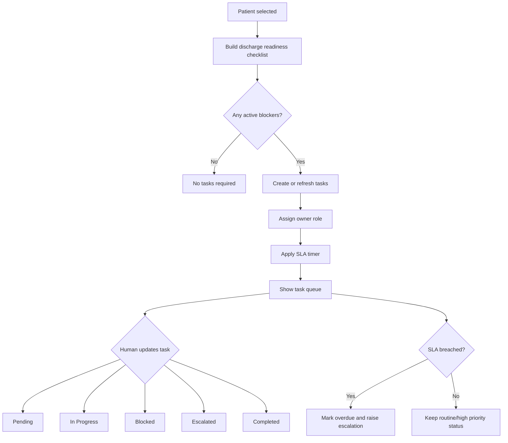

# Stage 3 — Task Ownership and Escalation Workflow

Stage 3 upgrades BedFlow AI from a patient-level recommendation demo into a more realistic hospital workflow tool.

Before this stage, the system could identify discharge blockers and show a readiness checklist. After this stage, those blockers become operational tasks with owners, statuses, SLA timers, overdue flags, and escalation levels.

---

## What this stage adds

- Local task workflow store: `<BEDFLOW_DATA_DIR>/tasks.json` (defaults to `<BEDFLOW_DATA_DIR>/tasks.json`)
- New backend module: `backend/tasks.py`
- Task generation from discharge checklist blockers
- Owner roles for each task
- Task status updates
- SLA countdowns
- Overdue detection
- Escalation level calculation
- Patient-level task panel inside the Control Tower
- Hospital-wide **Tasks & Escalations** tab
- Audit-log snapshot of patient tasks at the time of human decision

---

## New user flow

```text
Hospital snapshot
→ Unit bed board
→ Prioritized discharge queue
→ Select patient
→ Discharge readiness checklist
→ Task ownership and escalation panel
→ Evaluate patient case
→ Committee recommendation
→ Human review
→ Audit log with checklist and task snapshot
```

---

## Task lifecycle



---

## Task fields

Each task record includes:

| Field | Meaning |
|---|---|
| `task_id` | Stable task identifier generated from patient ID and checklist item |
| `patient_id` | Patient associated with the task |
| `task_type` | The discharge blocker task |
| `owner_role` | Role responsible for action |
| `status` | Workflow status |
| `severity` | Clinical/operational severity from the checklist |
| `recommended_action` | Next action for the owner |
| `created_at` | Task creation time |
| `updated_at` | Last update time |
| `completed_at` | Completion time if completed |
| `sla_minutes` | Target completion window |
| `minutes_waiting` | Runtime field calculated from creation time |
| `minutes_until_due` | Runtime SLA countdown |
| `overdue` | Runtime boolean flag |
| `escalation_level` | Routine, Medium, High, or Critical |
| `notes` | Status-update history |

---

## Supported statuses

```text
Not Started
Pending
In Progress
Blocked
Completed
Escalated
```

---

## Owner roles

```text
Physician
Pharmacy
Transport
Utilization Management
Case Manager
Social Worker
Family / Case Manager
Bed Manager
```

---

## SLA examples

These are demonstration defaults, not real hospital policy.

| Task type | SLA |
|---|---:|
| Lab/vital safety review | 60 minutes |
| Doctor discharge order | 90 minutes |
| Pharmacy medication reconciliation | 120 minutes |
| Transport arrangement | 90 minutes |
| Insurance authorization | 240 minutes |
| Rehab/SNF placement | 360 minutes |
| Home care setup | 240 minutes |

---

## New backend endpoints

```text
GET  /api/tasks
GET  /api/tasks?patient_id=<patient_id>
GET  /api/tasks?owner=<role>
GET  /api/tasks?status=<status>
GET  /api/tasks/summary
GET  /api/tasks/overdue
GET  /api/tasks/<patient_id>
POST /api/tasks/sync
POST /api/tasks/sync_all
POST /api/tasks/update_status
```

---

## Files added

```text
backend/tasks.py
<BEDFLOW_DATA_DIR>/tasks.json
docs/STAGE_3_TASK_OWNERSHIP_AND_ESCALATION.md
```

---

## Files modified

```text
backend/api.py
backend/audit.py
frontend/dashboard.py
README.md
docs/BEDFLOW_PROFESSIONALIZATION_STAGES.md
```

---

## Why this makes the app more professional

A hospital flow product is not just a prediction screen. It needs to show who owns each discharge blocker, how long it has been waiting, whether it is overdue, and whether it requires escalation.

This stage makes BedFlow feel more like an operational command-center system because the user can now track work, not just view recommendations.

---

## Remaining limitation

The task layer currently uses local JSON persistence. A production version should use a database such as PostgreSQL or SQLite with authentication, user IDs, concurrency control, and immutable audit records.
