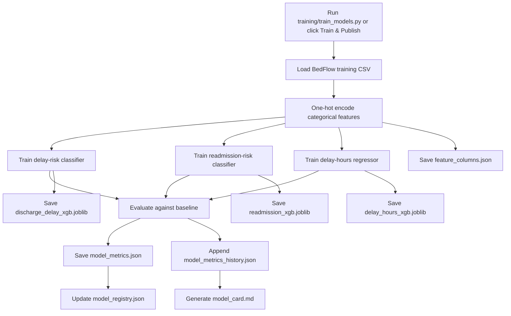
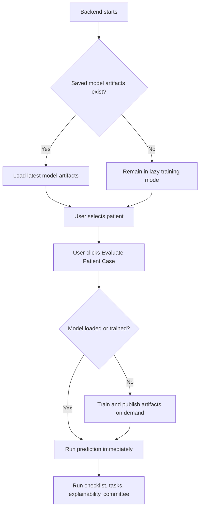

# Stage 5 — Model Lifecycle and Governance

Stage 5 moves BedFlow AI from demo-style request-time training toward a more professional machine-learning lifecycle.

Before this stage, the backend could train XGBoost models on demand and keep them in memory. That worked for a demo, but a hospital-style system should make the model version, training date, artifacts, feature columns, metrics history, and limitations visible.

## What Stage 5 adds

- Versioned saved model artifacts under `models/`
- Saved feature-column artifact
- Model registry JSON
- Metrics history JSON
- Generated model card
- Offline training script
- Dashboard governance panel
- API endpoints for governance, metrics history, model card, and loading saved artifacts

## Files added

```text
training/train_models.py
models/model_registry.json
models/feature_columns.json
models/model_card.md
models/discharge_delay_xgb.joblib
models/readmission_xgb.joblib
models/delay_hours_xgb.joblib
database/model_metrics_history.json
docs/STAGE_5_MODEL_LIFECYCLE_AND_GOVERNANCE.md
```

The `.joblib` files are created when models are trained. They are included in the demo ZIP when training has been run successfully.

## Files modified

```text
backend/models.py
backend/api.py
frontend/dashboard.py
README.md
requirements.txt
docs/BEDFLOW_PROFESSIONALIZATION_STAGES.md
```

## New backend endpoints

```text
POST /api/train_models
GET  /api/model_governance
POST /api/load_latest_model
GET  /api/model_card
GET  /api/model_metrics_history
```

## New training flow



## New inference flow



## What appears in the UI

The **Model Performance & Governance** tab now shows:

- Active model status
- Active model version
- Active source: saved artifact vs in-memory trained model
- Feature count
- Metrics-history run count
- Dataset path, row count, and dataset hash
- Artifact registry table
- Model card expander
- Metrics history expander
- Global feature importance

## Why this makes the app more professional

Hospitals and healthcare technology reviewers care about more than the model result. They need to know:

- Which model version made the prediction?
- What data was it trained on?
- When was it trained?
- What metrics were recorded?
- What artifacts are loaded?
- What are the model limitations?
- Can the model be audited later?

Stage 5 gives BedFlow AI a visible answer to those questions.

## How to train from the command line

From the repository root:

```bash
python training/train_models.py
```

## How to train from the UI

Open Streamlit, go to:

```text
Model Performance & Governance → Train & Publish Versioned Models
```

## Production limitations

This is still a portfolio/demo implementation. A real hospital deployment would require:

- Approved model registry and model promotion workflow
- Dataset versioning and lineage controls
- Monitoring and drift detection
- Clinical validation
- PHI-safe infrastructure
- Authentication and role-based access control
- Immutable audit logging
- EHR/FHIR integration
